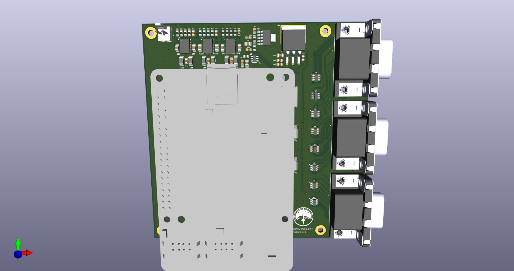

# High-Precision Raspberry Pi DAQ Board

A custom Data Acquisition (DAQ) hat designed for the Raspberry Pi. This board interfaces with industrial sensors (RTDs, Load Cells, Pressure Transducers) to log and display live data with high precision.

The system features a robust, low-noise power architecture that manages 24VDC input to power the sensors, the precision analog circuitry, and the Raspberry Pi itself. It utilizes dual 24-bit ADCs communicating over SPI for high-resolution signal digitization.

## Features

* **Multi-Sensor Interface:** Three 15-position D-sub connectors for attaching RTDs, Load Cells, and Pressure Transducers.
* **Input Protection:** Every signal line is protected by TVS diode arrays to guard against ESD and surge events.
* **High-Resolution Sampling:** Dual 24-bit ADCs transmit data via SPI to the Raspberry Pi.
* **Low-Noise Power Architecture:**
    * Accepts 24 VDC input.
    * On-board Buck converters for high-efficiency voltage step-down.
    * LDOs and precision voltage references ensure clean power rails for the ADCs and sensors.
    * High-current supply dedicated to the Raspberry Pi.
* **Compact Design:** PCB fits within a 10cm x 10cm footprint to minimize manufacturing costs.

### 3D Rendering

### Layout View

